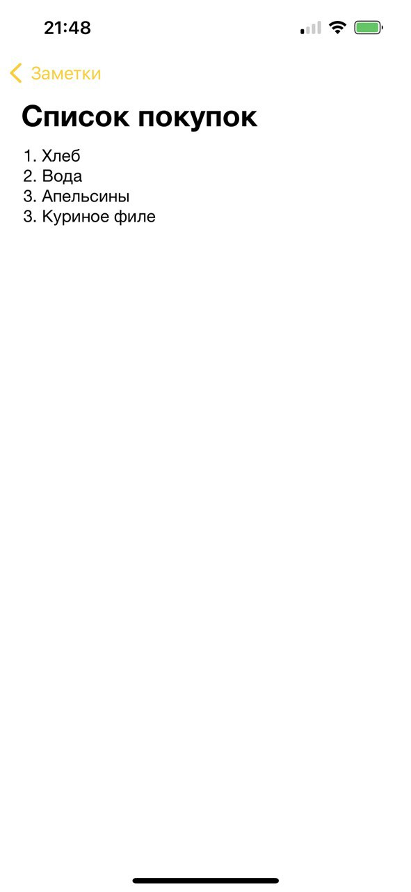

#  Заметки

Данное приложение предназначено для создания заметок  

## Возможности приложения
- Создание заметок с текстом
- Просмотр существующих заметки в порядке обновления
- Удаление заметок
- Заметки сохраняются между сеансами приложения
- При первом запуске создается заметка с текстом

## Описание структуры проекта
- Директория `Controllers` содержит ViewController'ы приложения. `EditNoteViewController` предназначен для редактирования/создания заметок, `NotesListViewController` предназначен для просмотра списка заметок. 
- Файл `Models/Note.swift` содержит модель заметки `Note`
- Файл `Views/NoteCellView.swift` содержит класс ячейки для отображения заметки
- В файле `Constants/Constants.swift` содержатся константы, необходимые для работы приложения
- В директории `Repository` содержится протокол репозитория для хранения заметок и реализация данного протокола при помощи `UserDefaults`. В дальнейшем можно добавлять другие реализации данного протокола. 
 
